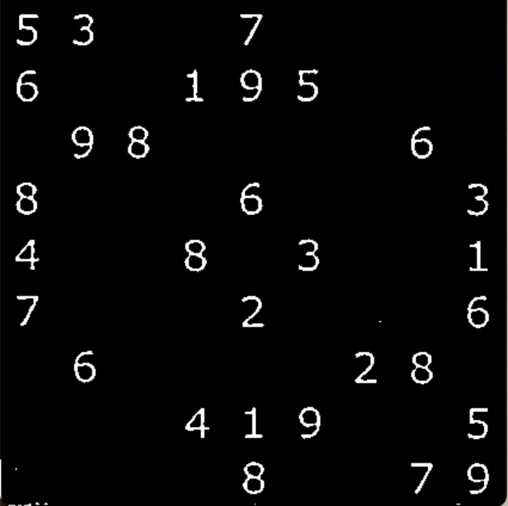
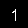
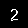
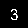
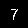
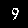

# Sudoku  
Sudoku solver using Computer Vision and Deep Learning. 
# Computer Vision
Using OpenCv to detect the board from a video stream.  
Getting a bird eye view of the board and extacting the cells.

# Deep Learning  
## first we create synthetic digits images  
Creating 28x28 images of digit using pillow, and augmentating the data using OpenCv to create different representation of digits.  
The augmentation includes different fonts, rotation and Morphological Transformations  
such as erode, opening, closing,and sharpening.

